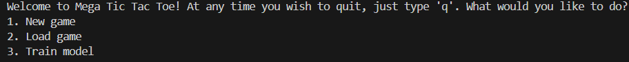
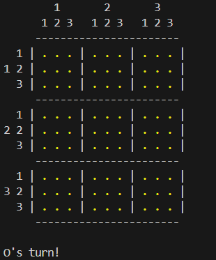
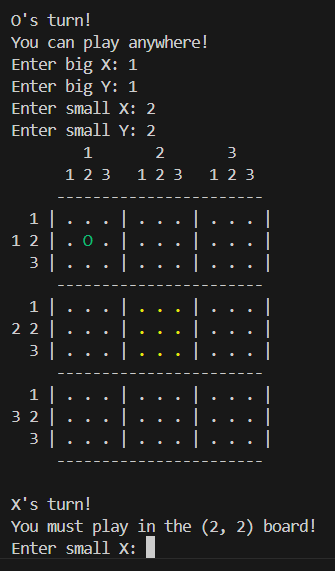
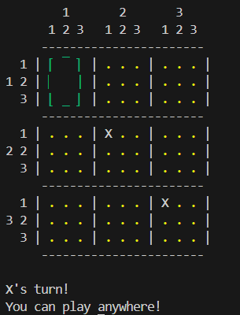

# PyTicTacToe-RL

This is my project for my university Python course. It represents a console game of Mega Tic-Tac-Toe including agent players, trained with Reinforcement learning.

## Features

- Console-based triple Tic-Tac-Toe game
- Agent players training using Reinforcement Learning
- Human vs. Human and Human vs. Agent modes
- Saving and loading the game state into and from a JSON file

## Project Information

The PyTicTacToe-RL project is a game of advanced version of the classic Tic-Tac-Toe game. The game is played on a 3x3 grid, but with a twist: players must win three games in a row to achieve victory. The project leverages Reinforcement Learning to train agent players, using a Deep Q-Network from the library Stable Baselines 3.

## Installation

1. Clone the repository:
    ```bash
    git clone https://github.com/yourusername/PyTicTacToe-RL.git
    ```
2. Navigate to the project directory:
    ```bash
    cd PyTicTacToe-RL
    ```
3. Create a virtual environment:
    ```bash
    python -m venv venv
    ```
4. Activate the virtual environment:
    - On Windows:
        ```bash
        venv\Scripts\activate
        ```
    - On macOS/Linux:
        ```bash
        source venv/bin/activate
        ```
5. Install the required dependencies:
    ```bash
    pip install -r requirements.txt
    ```

## Usage

1. Run the game:
    ```bash
    python main.py
    ```
2. Follow the on-screen instructions to play the game.

## Navigating the Menu

At any moment, if you type "q" in the console, the application will quit. When you run the game, you will be presented with a menu that allows you to chooses:



1. **New game**: Begin a new game and choose an opponent.
2. **Load game**: Load a game from a JSON file.
3. **Train model**: Train a new model to play Mega Tic Tac Toe.

## The Game Rules
The board consists of 3x3 games of normal Tic-Tac-Toe. This is what the it looks like:



You can place your mark by typing the coordinates (1 - 3) of the game you want to play on and the coordinates of the exact position of the mark. By doing so the next player is obligated to play in the game with coordinates equal to those of your mark in the game you chose. Let's say O chose to play (2, 2) in game (1, 1). Then X will have to play in game (2, 2):



If the game you should play on is already won or full then you can play anywhere!



When you win a small game, you place your mark on the whole game cell. You win when you have won 3 games in a row, forming a line of big marks just like regular Tic-Tac-Toe.